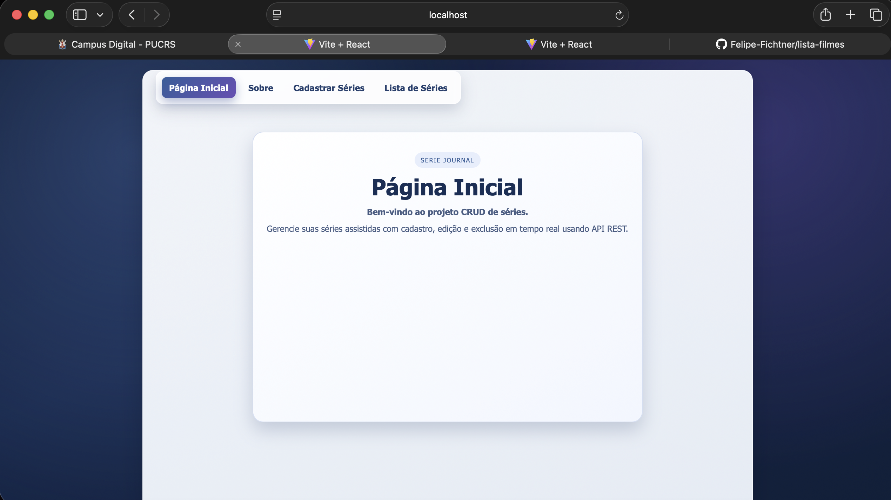
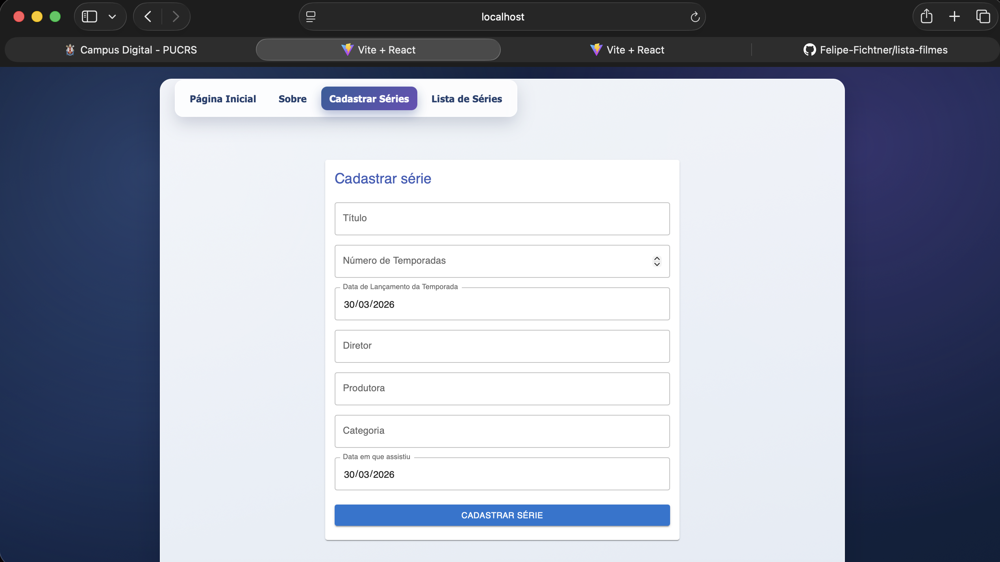
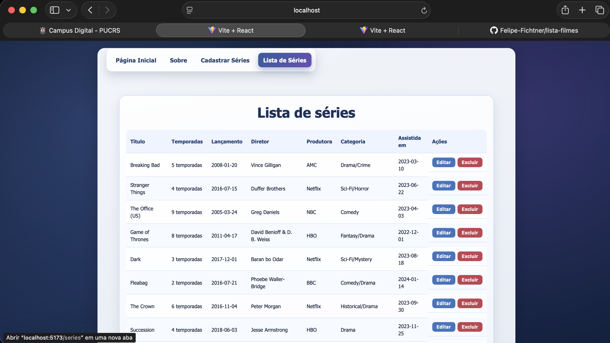

# Serie Journal - CRUD de Series

## Identificacao

- Aluno: Felipe Fichtner
- Disciplina: Desenvolvimento de Sistemas Frontend
- Fase: 2

## Descricao do Projeto

Aplicacao React para gerenciamento de series assistidas com consumo de API REST.
O projeto implementa rotas, formulario com validacao e operacoes CRUD completas
usando os dados retornados pelo backend serieJournal-api.

## Requisitos

- Node.js 18+ (recomendado)
- npm
- API serieJournal-api em execucao

## Destaques da Fase 2

- Integracao com Axios para requisicoes HTTP
- Interface com Material UI (AppBar, Card, TextField, Button)
- Testes de componentes com Vitest + React Testing Library
- Tratamento de erros e estados de carregamento

## Como executar

1. Instale e execute a API (backend):

```bash
git clone https://github.com/adsPucrsOnline/DesenvolvimentoFrontend.git
cd DesenvolvimentoFrontend/serieJournal-api
npm install
PORT=5001 npm start
```

2. Em outro terminal, execute o frontend:

```bash
npm install
npm run dev
```

3. Se necessario, informe a URL da API no frontend:

```bash
VITE_API_URL=http://localhost:5001 npm run dev
```

4. Abra no navegador:

http://localhost:5173

## Rodando testes

```bash
npm run test
```

## Integracao com API

O frontend usa Axios para consumir os endpoints REST:

- GET /series
- GET /series/:id
- POST /series
- PUT /series
- DELETE /series/:id

Campos usados no payload:

- title
- seasons
- releaseDate
- director
- production
- category
- watchedAt

## Estrutura principal

```text
src/
  components/
    NavBar/
    SerieForm/
    SerieList/
  pages/
    Home.jsx
    Sobre.jsx
  services/
    seriesApi.js
  App.jsx
```

## Funcionalidades

- Pagina inicial e pagina sobre
- Cadastro de serie com validacao dos campos obrigatorios
- Listagem de series vindas da API
- Edicao de serie por rota /editar/:id
- Exclusao com confirmacao
- Feedback visual para erro e carregamento da API

## Prints da Aplicacao

### Pagina Inicial


### Sobre


### Cadastrar Series


### Lista de Series


## Tecnologias

- React 18
- Vite 5
- React Router DOM
- Axios
- Material UI
- Vitest
- React Testing Library
- JavaScript (JSX)
