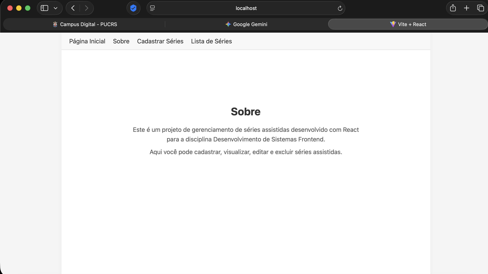
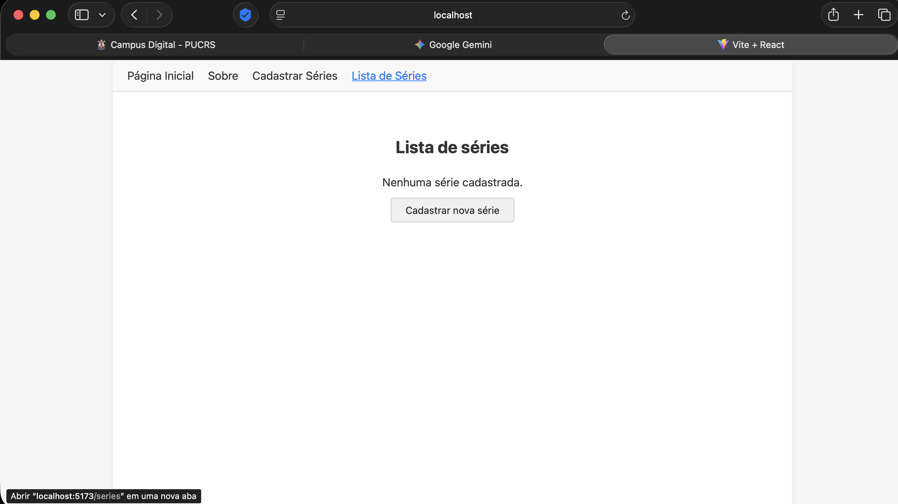

# Serie Journal - CRUD de Séries

## Identificação

- **Aluno:** Felipe Fichtner
- **Disciplina:** Desenvolvimento de Sistemas Frontend
- **Fase:** 1

## descrição do Projeto

projeto de gerenciamento de séries assistidas desenvolvido com React + Vite para a disciplina de Desenvolvimento de Sistemas Frontend (PUCRS Online). A aplicação permite cadastrar, visualizar, editar e excluir séries assistidas de forma dinâmica e intuitiva.

## Como executar o projeto

1. Extraia o arquivo `.zip`
2. Abra o terminal na pasta do projeto
3. Instale as dependências:

```bash
npm install
```

4. Inicie o servidor de desenvolvimento:

```bash
npm run dev
```

5. Acesse no navegador: `http://localhost:5173`

## Estrutura do projeto

```
src/
├── components/
│   ├── NavBar/        → Componente de navegação com links para as páginas
│   ├── SerieForm/     → Formulário para cadastro e edição de séries
│   └── SerieList/     → Listagem de séries com opções de editar e excluir
├── pages/
│   ├── Home.jsx       → Página inicial de boas-vindas
│   └── Sobre.jsx      → Página informativa sobre o projeto
├── App.jsx            → Componente principal com rotas e gerenciamento de estado
├── App.css            → Estilos do layout principal
├── index.css          → Estilos globais
└── main.jsx           → Ponto de entrada da aplicação
```

## Componentes

### NavBar
Componente de navegação presente em todas as páginas. Contém links para: Página Inicial, Sobre, Cadastrar Séries e Lista de Séries. Utiliza `react-router-dom` para navegação sem recarregamento da página.

### SerieForm
Componente de formulário para inclusão e edição de séries. Possui os seguintes campos obrigatórios:
- **Título** (texto)
- **Número de Temporadas** (número)
- **Data de Lançamento da Temporada** (data)
- **Diretor** (texto)
- **Produtora** (texto)
- **Categoria** (texto)
- **Data em que assistiu** (data)

Implementa validação de todos os campos com mensagens de erro visíveis ao usuário. Também é reutilizado para edição de séries existentes.

### SerieList
Componente de listagem que exibe todas as séries cadastradas em formato de tabela. Cada item possui botões de **Editar** e **Excluir**. A exclusão solicita confirmação do usuário antes de remover.

## Páginas

- **Página Inicial (`/`)**: Tela de boas-vindas ao usuário
- **Sobre (`/sobre`)**: Informações sobre o projeto
- **Cadastrar Séries (`/cadastrar`)**: Formulário para adicionar ou editar séries
- **Lista de Séries (`/series`)**: Visualização completa com ações de edição e exclusão

## Funcionalidades (CRUD)

- **Criação**: Cadastro de novas séries via formulário com validação
- **Leitura**: Listagem de todas as séries cadastradas
- **Edição**: Alteração dos dados de uma série existente
- **Exclusão**: Remoção de série com confirmação

## Prints da Aplicação

### Página Inicial


### Sobre


### Cadastrar Séries


### Lista de Séries


## Tecnologias

- React 18
- Vite 5
- React Router DOM
- JavaScript (JSX)
